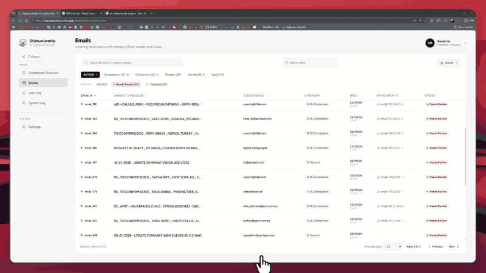
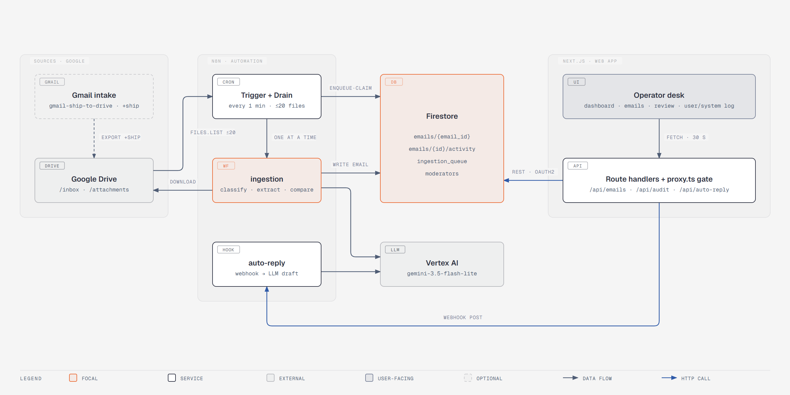
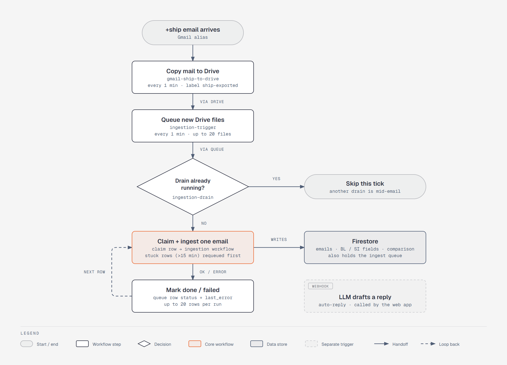
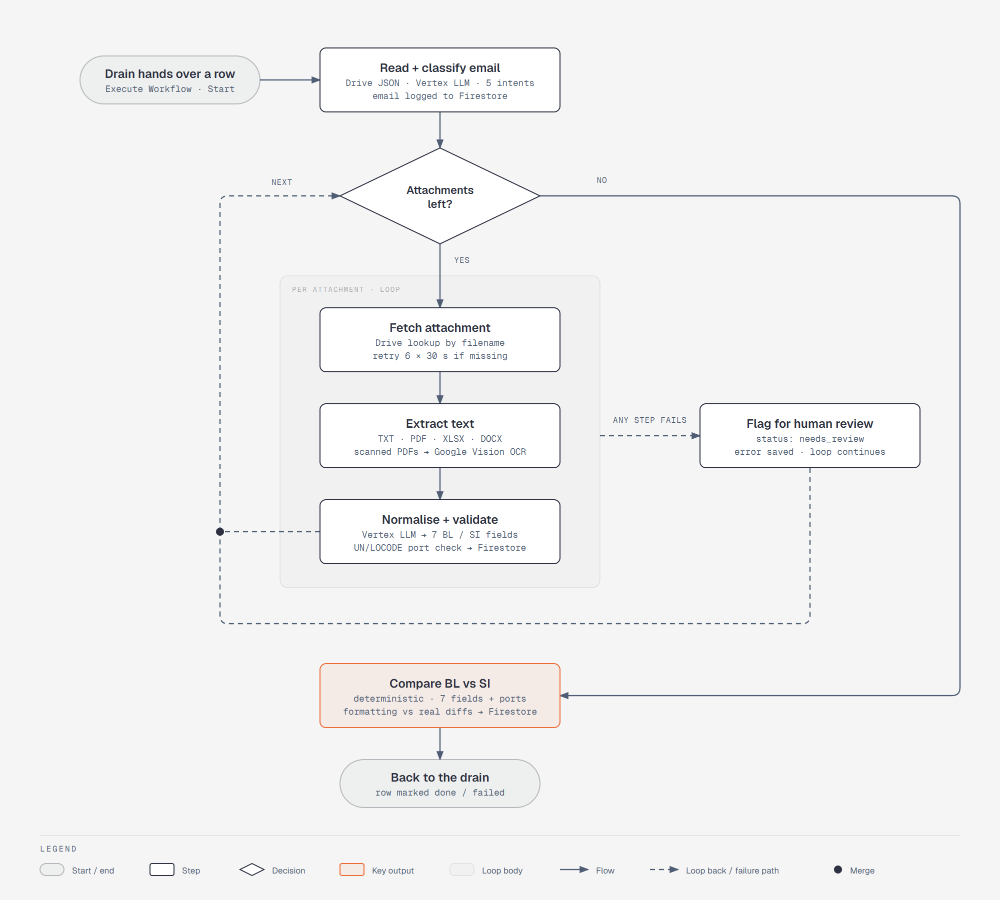

<div align="center">


# Shiptuationship

### AI Logistics Assistant

**From a noisy shipping inbox to a clear discrepancy report.**
Shiptuationship reads every incoming email, works out what it is, compares the Shipping Instruction (SI) against the draft Bill of Lading (BL) on seven fields, and hands anything uncertain to a human reviewer, with the evidence attached.

| | |
|---|---|
| **Live app (Vercel)** | https://shiptuationship.vercel.app/ |
| **Demo video** | https://youtu.be/eKVVBMr-v50 |
| **Test it by email** | [Send a test email](mailto:syho81336.ho+ship@gmail.com?subject=Document%20check%20request) |
| **Test it by upload** | [Drop a test file into the Drive `/inbox` and `/attachments` folder](https://drive.google.com/drive/folders/1LqdG7w1Sy2AvcCPYbrJbCBRO2JoWrTKK) |

</div>

<p align="center">
  
</p>

---

## Table of contents

1. [The problem](#1-the-problem)
2. [Our solution at a glance](#2-our-solution-at-a-glance)
3. [Technical architecture](#3-technical-architecture)
4. [Something interesting: the dataset's port codes were wrong](#4-something-interesting-the-datasets-port-codes-were-wrong)
5. [Implementation details](#5-implementation-details)
6. [Challenges faced](#6-challenges-faced)
7. [Success metrics](#7-success-metrics)
8. [Known limitations](#8-known-limitations)
9. [Future roadmap](#9-future-roadmap)
10. [Setup instructions](#10-setup-instructions)
11. [Project structure and scripts](#11-project-structure-and-scripts)
12. [Team/contributors](#12-team-and-contributions)

---

## 1. The problem

> **The challenge:** turn a busy shipping-operations inbox into a clear, trustworthy discrepancy report, from the raw email all the way to "these fields don't match, and here is why."

### 1.1 Context

A shipping operations team receives very different messages in **one shared inbox**: requests to check documents, requests to prepare new shipping instructions, invoice questions and operational updates, with spam arriving alongside them.

For a **document-checking request**, the team compares a **Shipping Instruction (SI)**, which holds the intended shipment details, against a **draft Bill of Lading (BL)**. The SI is the reference. The goal is to **catch incorrect details before the draft is finalised**.

### 1.2 The three problems

| # | Problem | Why it hurts |
|---|---------|--------------|
| 1 | **Finding the right emails takes time.** Staff must read each message and decide what it needs. | A document request that is overlooked never reaches the checking step. |
| 2 | **Manual comparison is repetitive and error-prone.** Names, ports, quantities and weights must be checked across two documents. | A missed discrepancy means corrections, delays and extra work. |
| 3 | **The same information looks different.** One document says "Port of Loading", the other says "Load Port". | The system has to recognise that both labels mean the same field. |

### 1.3 What the system must be able to do

| Capability | What it means |
|------------|---------------|
| **Classify** | Tell messages apart: document-comparison requests, new SI requests, invoice queries, general messages and spam. Only document-comparison requests continue to the checking step. |
| **Extract data** | For comparison requests, read the SI and BL attachments and identify the matching shipment fields. |
| **Compare** | Check the values and surface every mismatched field, showing the **SI and BL values side by side**. |
| **Ask for help** | When the system cannot finish on its own, **escalate to a person (human in the loop)** with the relevant context, instead of guessing or failing silently. |

### 1.4 What is compared: the seven fields

| # | Field | Notes |
|---|-------|-------|
| 1 | Shipper | |
| 2 | Consignee | |
| 3 | Notify Party | |
| 4 | Port of Loading (POL) | |
| 5 | Port of Discharge (POD) | |
| 6 | Container count | integer |
| 7 | Gross weight | in **kilograms** |

The report must make it easy to see **which email was checked, whether a mismatch was found, and exactly what needs attention**. If all seven fields match, report **"No mismatch detected."**

> **Worked example:** the SI lists 3 containers and 22,000 kg, the BL lists 4 containers and 22,000 kg. If everything else agrees, flag **only** the container count and show **SI: 3 / BL: 4**.

### 1.5 Where it gets hard: real-world inboxes

Classifying emails, pulling fields out of a plain-text file and comparing seven values is the easy part. Real inboxes are much messier, and that is where a system like this earns its keep:

- **Documents that aren't plain text.** SIs and BLs arrive as PDFs, Word files and spreadsheets, with tables and layouts that differ from sender to sender.
- **Scanned pages.** Some documents are just images of paper, so the text has to be read with OCR or a vision-capable model first.
- **Untidy details.** Fields are labelled differently from one document to the next, formats vary, an email's subject line may have nothing to do with what it asks for, and an attachment may simply be missing. The system has to tell a *genuine* discrepancy apart from a reading or formatting quirk.
- **Knowing when not to decide.** If a document is unreadable, a value is missing or the result is uncertain, the honest move is to hand the case to a person **with the source evidence and the reason**, let them confirm or correct it, and update the report. Processing failures need to be **visible** and **easy to retry**, never silent.

Success is measured by finding the **right requests** and the **right discrepancies** without raising **false alarms**. The input is a set of JSON inbox records plus the SI and BL attachments they reference.

### 1.6 How Shiptuationship answers it

| Requirement | Our answer | Where |
|-------------|------------|-------|
| Classify into 5 kinds of message | LLM classifier with a strict prompt and a validator. The categories are `Document-Comparison Request`, `New SI Request`, `Invoice Queries`, `General Messages` and `Other` (ambiguous or spam). | n8n `ingestion` → *Main Classifier* |
| Extract the 7 fields | LLM extractor with a full alias table (`POL`, `LOAD PORT`, `NTFY`, `G.W.` and so on), unit conversion (lbs, MT → kg) and container summing. | n8n `ingestion` → *Field Normalise* |
| PDF, Word, Excel, text attachments | Dedicated parsers per file type, including DOCX unzip and Excel row merging. | n8n `ingestion` |
| Compare and show SI vs BL side by side | **Deterministic** (non-LLM) comparison, then a side-by-side review screen. | n8n *Compare Fields* + web app *ReviewModal* |
| Real discrepancy vs formatting difference | Normalisation and a formatting/real/severity classification. Formatting-only differences are recorded but not flagged. | n8n *Compare Fields* |
| Human in the loop | Flagged and incomplete cases are queued for a moderator who can edit either document's values, save, and re-run the comparison. | Web app *Emails* page |
| Visible failures and retries | Per-email queue with `queued → processing → done / failed`, `last_error` recorded. A missing attachment auto-retries for 3 minutes inside `ingestion`; a `failed` queue row still needs a manual retry. | n8n `ingestion-drain` |
| "Which email, mismatch or not, what needs attention" | Dashboard, filterable email table, per-email discrepancy banner, audit logs. | Web app |

> **Scanned or image-only PDFs** get a Google Vision OCR fallback (see [5.3](#53-attachment-handling-and-field-extraction)); a scanned DOCX or a standalone image attachment does not, and still surfaces as an attachment error for a human. See [Known limitations](#8-known-limitations) and the [roadmap](#9-future-roadmap).

---

## 2. Our solution at a glance

Shiptuationship has **two halves** that share one database:

- **An automated back end (n8n + Google Vertex AI)** that watches a Google Drive inbox, classifies every email, extracts the seven fields from the SI and BL attachments, runs the comparison and writes the result to **Firestore**.
- **A web app (Next.js)**, the *AI Logistics Assistant*, with a public front page and a logged-in desk where an operator sees everything at a glance, reviews flagged emails side by side, corrects values, marks emails as read, and audits what both the automation and the humans did.

### Why this stack

| | |
|---|---|
| **100% cloud native** | **Google Cloud Run**, **Google Drive**, **Google Cloud Firestore** and **Vercel**. Nothing to provision or patch: every layer scales on its own, which makes the project infinitely scalable. |
| **n8n as the back end** | Enterprise-grade automation platform trusted by Fortune 500 companies, including **Microsoft, Meta and Nvidia**. Low-code and visual: with a visual canvas and low-code node logic, n8n gives end-to-end visibility into every stage of document ingestion and ultimate flexibility to introduce new features. |
| **Gemini 3.5 Flash-Lite** | Google's latest low-latency, cost-efficient reasoning model. The right balance of efficiency and accuracy for classification, extraction and reply drafting. In practice an email is classified and stored in **~4 s**, and a full SI/BL comparison (two attachments parsed, extracted and compared) in **~20 s**. |
| **Google Vision API** | OCR that extracts text from scanned pages and image-only PDFs, so a paper document is read rather than skipped. |

### UI/UX highlights

- **Familiar by design.** A user-friendly Next.js front end whose intuitive layout is inspired by everyday tools an average consumer already uses, i.e. **Gmail** and **Discord**.
- **5 themes** to choose from: Light, Dark, Ocean, Forest and Sunset.
- **Print / PDF.** One click prints a clear summary of the entire thread, for easy documentation or to escalate for management approval.
- **AI email replies** generated on request.
- **Intuitive dashboard overview** with all the important metrics.
- **Real-time updates** of all changes made, by humans and by the automation.

### Feature tour

| Area | What you get |
|------|--------------|
| **Front page and login** | A product-style front page at which is always light, sections fade in as you scroll where the browser supports it. **Log in** checks your email and password against the `moderators` collection in Firestore and opens `/dashboard`. There is no sign-up: moderators are added by hand (see [10.4](#104-getting-the-google-refresh-token-one-time)). Clicking your profile (top right, or the avatar on phones) opens a menu with **Log out**, which returns to the front page|
| **Dashboard** | Live counters (unread and read with a progress bar and per-category breakdown), **Total Comparison Requests** with one-click **Emails Cleared** and **Pending Validation** buttons, an interactive **Emails by Category** donut (click a slice to highlight it, click again to open those emails), **Top 3** shippers, consignees, notify parties and senders, and two **world heat maps** (outbound Port of Loading, inbound Port of Discharge). |
| **Emails** | A Gmail-style inbox: unread rows are bold with a dot, filter tabs (All / Comparisons / SI Requests / Invoices / General / Other, plus **Needs Review** and **Validated**), search, date-range picker, sortable columns. Every filter has its own URL (`/emails?view=needs-review`). Cards on phones and tablets. |
| **Review screen** | For comparison emails: manifest fields form, **SI and Draft BL side by side** with the differing fields in red (only on the document being edited), an *Editing: Carrier Draft BL / Customer SI* switch, save with an automatic re-comparison and "Mark as read". A **Read Email** view swaps the comparison for the original email (the form hides so the email gets the whole window). Round **‹ ›** buttons beside the window (and the left/right arrow keys) step to the previous or next email in the list as currently filtered and sorted. **Print** opens an A4 print preview in a new tab (save it as a PDF). Attachments that n8n stored a Drive link for (the SI and BL files) open in Google Drive. **Generate auto reply** shows a loading cogwheel, calls the n8n `auto-reply` workflow (Gemini via Vertex AI), and returns a real drafted reply into an editable, copyable box. On phones the *Human review required* reasons fold away behind a chevron. |
| **User Log** | A chronological audit feed of every **moderator action** (reviews saved, emails marked read), with before/after field changes you can expand. |
| **System Log** | The same feed for everything the automation did (classified, auto-compared), shown as **Ship AI** with the Shiptuationship logo as its avatar. |
| **Settings**  | Five colour schemes for the app: Light, Dark (true black), Ocean, Forest and Sunset. The front page ignores them and is always light. |
| **Everywhere** | Fully responsive (drawer menu on phones, cards instead of tables), animated but respects *reduced motion*, refreshes from Firestore every 30 seconds. |

---

## 3. Technical architecture

### 3.1 Big picture

 <br/>

- **n8n pipeline overview** — from a `+ship` email arriving to the row landing in Firestore, plus the separate auto-reply webhook:

 <br/>

- **Inside the ingestion workflow** — one email in: classify it, loop over each attachment to fetch, extract and normalise it (flagging failures for a human instead of guessing), then compare BL against SI:

 <br/>

### 3.2 End-to-end flow of one email

1. **(Optional) `gmail-ship-to-drive`** (every minute) polls Gmail for mail sent to the `+ship` address that isn't yet labelled `ship-exported`, uploads its attachments and a JSON manifest to the Drive `/attachments` and `/inbox` folders (manifest last, so a file is only ever seen once it's complete), then labels the message so it isn't re-read. Skip this step if files are dropped into Drive by hand instead.
2. **A file lands in the Drive `/inbox` folder** (an email in JSON form).
3. **`ingestion-trigger`** (every minute) asks Drive for the 20 oldest files at or after its cursor and writes one small **queue row** per file to Firestore (`status: queued`).
4. **`ingestion-drain`** (every minute) claims queued rows **one at a time** (`processing`) and runs the `ingestion` sub-workflow for each.
5. **`ingestion`** does the real work:
   1. Parses the email JSON and **classifies** it (LLM, strict JSON, validated).
   2. Logs the email to Firestore (`emails/{email_id}`) with its classification.
   3. For **Document-Comparison Requests**: finds each attachment in Drive (a missing file is retried for up to 3 minutes before failing), parses it by type (TXT / PDF / XLSX / DOCX), sends a scanned PDF through **Google Vision OCR** if it has too little extracted text, asks the LLM to **extract the 7 fields** and to say whether it is an **SI or a BL**, then stores the result under `si` and `bl`.
   4. Runs a **deterministic comparison** in code and writes `comparison`, `status` (`cleared` / `flagged` / `incomplete`) and `human_review_required`.
6. The queue row is marked `done` or `failed` (with `last_error`).
7. **The web app** reads `emails` through its own API routes. An operator opens a flagged email, sees the SI and BL side by side, corrects a value if the extraction was wrong, and saves.
8. The save is written as a **moderator override** (never touching what n8n wrote), the comparison is re-run, and an **activity record** is added, which feeds the **User Log**. The n8n side feeds the **System Log**.

### 3.3 Technology stack

| Layer | Technology | Responsibility |
|-------|------------|----------------|
| Front end | **Next.js 16** (App Router), **React 19**, **TypeScript** | Dashboard, inbox, review UI, audit logs |
| Styling | Hand-written **CSS** (design tokens and per-theme variables). No CSS framework | Responsive layout, five colour schemes |
| Charts | Custom **SVG** donut and bars, **Google Charts GeoChart** (loaded from `gstatic`, no API key) | Category chart, top-3 bars, heat maps |
| Server side of the web app | Next.js **route handlers** (Node runtime) | Talk to Firestore. Credentials never reach the browser |
| Log in | `/api/session` checks a scrypt password hash on the `moderators` document, then sets a signed HttpOnly cookie that Next.js **`proxy.ts`** verifies | Keeps logged-out visitors on the front page and off the data API, and attributes every action to the moderator who logged in |
| Database | **Google Cloud Firestore** via its **REST API** | Single source of truth |
| Auth to Firestore | **Google OAuth2 refresh token** (same model as the n8n credential) | No service account, no Firebase SDK |
| Automation | **n8n** (5 exported workflows in [`n8n/`](n8n)) | Gmail intake, ingestion, orchestration, comparison, auto-reply |
| AI | **Google Vertex AI**, model **`gemini-3.5-flash-lite`** | Classification, field extraction and auto-reply drafting |
| OCR | **Google Cloud Vision API** | Text from scanned pages and image-only PDFs |
| File storage | **Google Drive** | Dataset: `/inbox` emails and `/attachments` SI/BL files |
| Comparison | **JavaScript (n8n Code node)**, deterministic | 7-field comparison with normalisation |
| Hosting | **Google Cloud Run** (n8n), **Vercel** (web app) | Fully managed, 100% cloud native, scales on demand |

### 3.4 Data model (Firestore)

<details>
<summary><b><code>emails/{email_id}</code></b>: one document per email (click to expand)</summary>

| Field | Written by | Meaning |
|-------|-----------|---------|
| `email_id`, `subject`, `body`, `from`, `to`, `received_at` | n8n | Original email record. `received_at` is populated when `gmail-ship-to-drive` supplies the manifest, but is empty in the hackathon's static sample data; either way, the UI displays `classified_at`. |
| `attachments[]`, `attachment_count` | n8n | Attachment file names |
| `classification` | n8n | One of the 5 categories |
| `classified_at` | n8n | When the automation processed it. This is the date shown in the app |
| `classification_error`, `last_ingestion_error`, `missing_attachments_warning` | n8n | Why something needs human attention |
| `si`, `bl` | n8n | Extracted fields: `shipper`, `consignee`, `notify_party`, `port_of_loading`, `port_of_discharge`, `container_count`, `gross_weight_kg` |
| `si_source`, `bl_source` | n8n | The source attachment: `filename`, `drive_file_id` and `drive_link` (its Google Drive URL, which the web app uses to link that attachment) |
| `comparison` | n8n | `status`, `performed_at`, `discrepancies[]`, `formatting_notes[]`, and per-field `{ match, bl, si, discrepancy_type, severity, *_normalized }` |
| `status` | n8n, web app | `pending` / `needs_review` / `incomplete` / `flagged` / `cleared` |
| `human_review_required` | n8n, web app | `true` when a person must look at it |
| `review` | **web app** | `reviewed_by`, `reviewed_at`, `edited_side`, and the override maps `fields` (BL) and `si_fields` (SI) |
| `read_status` | **web app** | `is_read`, `marked_by`, `marked_at` |

</details>

<details>
<summary><b>Other collections</b> (click to expand)</summary>

| Path | Purpose |
|------|---------|
| `emails/{id}/activity/{eventId}` | Immutable audit record per moderator action: `moderator_id`, `action` (`review_saved` / `marked_read`), `edited_side`, `changes` (per-field before and after), `before`, `after`, `occurred_at` (server time). Feeds the **User Log** |
| `moderators/{id}` | One per moderator, added by hand (no sign-up). The id is the handle actions are attributed to. `display_name`, `role`, `email` (lowercase, the log in name), `password_hash` (from `npm run hash-password`) |
| `ingestion_queue/{createdTime}_{driveFileId}` | One row per Drive file: `file_id`, `name`, `created_time`, `status` (`queued → processing → done / failed`), `queued_at`, `claimed_at`, `finished_at`, `last_error` |

</details>

> **Design rule:** the web app **never edits** the `si` / `bl` maps that n8n writes. Human corrections live under `review.*`, so the original extraction is always preserved and a re-ingestion can never erase a human decision.

### 3.5 Web API (Next.js route handlers)

| Route | Method | Purpose |
|-------|--------|---------|
| `/api/emails` | `GET` | List emails, mapped to the shape the UI uses |
| `/api/emails/{id}/review` | `POST` | Body `{ side: "si" \| "bl", fields }`: save a verified override for one side, re-run the comparison, log the activity |
| `/api/emails/{id}/read` | `POST` | Mark an email as read (idempotent) |
| `/api/audit?source=user\|system` | `GET` | User Log (moderator activity) or System Log (n8n activity) |
| `/api/session` | `POST` / `DELETE` | Log in with body `{ email, password }` (`204` and a session cookie, or `401 {"error":"Wrong email or password"}`), log out |

Errors return `502` (Firestore unreachable), `404` (unknown email), `409` (conflict or precondition failed). Without a valid session cookie (see [5.4](#54-human-in-the-loop-the-web-app)) every `/api/*` route except `/api/session` returns `401 {"error":"Log in to continue"}`.

---

## 4. Something interesting: the dataset's port codes were wrong

### 4.1 How we noticed

While checking the first comparison results by hand, we kept seeing port fields that **looked** clean but didn't add up. A Port of Loading would be written as a city name followed by a five-letter code in brackets, in the usual `Name (CCXXX)` shape, and the code was simply **not the code for that port**: it belonged to a different location, sometimes in a different country, or it didn't exist in the UN/LOCODE registry at all.

> **Example from the dataset:** in email_13, the document said `TUTICORIN, INDIA (KEMBA))`, but `KEMBA` is actually the UN/LOCODE for *Mombasa, Kenya*. The name and the code disagreed, and nothing in the document said which one to trust.

That is a nasty class of error. A wrong code is not a formatting quirk that normalisation can smooth over, and it is not a straightforward mismatch either: the SI and the BL often carried the **same** wrong code, so a naive text comparison would have declared the two documents a match and let the error sail through. Both documents agreeing is not the same as both documents being right.

### 4.2 Why the obvious fixes don't work

| Option | Why we rejected it |
|--------|--------------------|
| Compare ports as plain text | Two documents with the same wrong code "match". The error is invisible. |
| Ask the LLM to correct the code | It will happily invent a plausible code. We wanted evidence, not a guess. |
| Strip the code and compare names only | Throws away the strongest identifier a document has, and `Portland` could be Oregon or Maine. |
| Hard-code a list of the ports in the sample data | Works for the demo and for nothing else. |

### 4.3 What we did: validate every port against the real UN/LOCODE registry

We added a dedicated **`Check Port Code`** step to the n8n `ingestion` workflow, between extraction and comparison, that treats a port value as a **claim to be verified** rather than a string to be compared:

1. **Embed the registry.** The full UN/LOCODE dataset is embedded straight into the n8n node's code, with a SHA-256 of the dataset recorded on every result. The check runs with no network, filesystem, packages or external database, so it is deterministic and works the same in every environment.
2. **Read the document's own evidence.** A bracketed code such as `Port Klang (MYPKG)` is taken as explicit. Otherwise a bare trailing code is recognised (while refusing to mistake `CHINA` or a five-letter place name for a code). Country names and common aliases (`USA`, `UAE`, `UK`, `PRC`, `Viet Nam`, ...) are peeled off the end and used to narrow the search, and the registry's subdivision column resolves `Portland OR` vs `Portland ME`.
3. **Cross-check name against code.** If both are present they must agree. If only a name is present it must resolve to **exactly one** LOCODE. Every port ends up with an explicit status:

   | Status | Meaning | What happens |
   |--------|---------|--------------|
   | `valid` | name and code agree | value rewritten to canonical `Name, Country (CODE)` |
   | `added` | a unique code was resolved from the name alone | same, code filled in |
   | `mismatch` | the document's code and name disagree | **routed to a human**, with both sides of the conflict spelled out |
   | `ambiguous` | the name matches several LOCODEs | routed to a human, listing the candidates |
   | `unknown_code` / `unknown_location` | not in the registry | routed to a human |
   | `missing` | blank, `N/A`, a country alone | routed to a human |

4. **Refuse to compare unverified ports.** `Compare Fields` requires **both** the SI and the BL side to be `valid` or `added` before a port field can match at all. Anything else fails that field and adds a specific reason to `human_review_reasons`, for example *"BL - Port of Loading: 'X' matches 2 UN/LOCODEs (…). Supply the intended code."* The email lands in **Needs Review** with the reason on screen, and the moderator fixes it in the review form.

### 4.4 What it bought us

- **Agreeing documents can still be flagged.** Two documents carrying the same wrong code are no longer a silent pass; the code is checked against the registry, not against the other document.
- **Canonical values everywhere.** What is stored in `si` / `bl` is `NAME, COUNTRY (CODE)`, so `Port Klang`, `PORT KLANG (MYPKG)` and `Port Klang, Malaysia` all compare equal, and the dashboard's heat maps can place every port on the map from its code.
- **Every escalation says why.** The moderator sees *"code and name disagree"* or *"matches 2 UN/LOCODEs"*, not a bare "mismatch", so the fix takes seconds.
- **No LLM in the loop.** The check is plain code over a versioned dataset. Same input, same answer, and a dataset hash on every result so it can be audited later.

---

## 5. Implementation details

### 5.1 Ingestion workflows (n8n)

Five workflows are exported in [`n8n/`](n8n):

| Workflow | Role | Memory per execution |
|----------|------|----------------------|
| **`gmail-ship-to-drive`** | Schedule (1 min), optional. Polls Gmail for unlabelled `+ship` mail, uploads each message's attachments and a JSON manifest to Drive, then labels the message `ship-exported` so it is not re-read | one email |
| **`ingestion-trigger`** | Schedule (1 min). Cursor = newest `created_time` in `ingestion_queue`. Asks Drive for the **20 oldest** files at or after it and writes one small queue document per file. Never runs the heavy workflow itself | ≤ 20 × 3 fields |
| **`ingestion-drain`** | Schedule (1 min). Exits if another drain is still running, re-queues rows stuck in `processing`, reads ≤ 20 `queued` rows and loops them **one at a time**: claim → `ingestion` → mark `done` / `failed` | ≤ 20 sub-results, one email in flight |
| **`ingestion`** | The actual pipeline for one email (45 nodes) | one email |
| **`auto-reply`** | Webhook, on demand. Called from `/api/auto-reply` with an email and its comparison result, drafts a reply with Gemini and returns it | one reply |

**How fast is it?** Measured on the n8n execution log, one `ingestion` run takes **about 4 s** for an email that only needs classifying (new SI request, invoice query, general, spam) and **about 20 s** for a document-comparison request, which also downloads, parses and extracts both attachments and runs the comparison. Every stage is visible per execution in n8n, so a slow or failed email is easy to find.

**Why the queue?** The native Google Drive Trigger has no limit: a 250-file drop would land in a single execution and hold 250 sub-workflow results in one heap. A capped `files.list` plus a Firestore queue means every run is bounded (20 files), retryable and visible.

### 5.2 Classification

An LLM (Google Vertex AI, `gemini-3.5-flash-lite`) returns **exactly one** JSON classification. The prompt is hardened for messy real-world inputs:

- The email is treated as **untrusted data**. Instructions inside it are never followed (prompt-injection guard).
- **Classify by the body, not the subject.** Subjects can be forwarded, re-used or misleading. The subject is only a tiebreaker.
- A document-comparison request stays a comparison request **even if an attachment is missing**, so it still reaches a human instead of vanishing.
- If a message fits several categories the priority is **comparison > new SI > invoice > general**. Anything ambiguous, unrelated or spam is **`Other`**.

A code node then **validates** the answer against the five allowed values. If the model fails or returns something invalid the email is stored as `Other` with `classification_error` and `status: needs_review`, so nothing is lost silently.

### 5.3 Attachment handling and field extraction

For each attachment of a comparison request:

1. **Find** it in the Drive `/attachments` folder. Zero matches is retried for up to 3 minutes (six 30 s attempts, in case the upload is still in flight), then recorded as an error; more than one match is a recorded `ambiguous` error. Neither case is guessed.
2. **Parse by type:** `.txt` (text), `.pdf` (text extraction), `.xlsx` (rows are combined into text), `.docx` (unzipped and read). Unsupported types are logged as an attachment error.
3. **OCR fallback for scanned PDFs.** If a parsed PDF averages under 50 characters of text per page, it's treated as image-only and sent to **Google Cloud Vision** (`files:annotate`, batched 5 pages per request) to OCR every page. A failed or partial OCR result fails the attachment rather than returning incomplete text. This does not cover scanned DOCX files or standalone image attachments, which are logged as unsupported.
4. **Extract** with the LLM into strict JSON. The prompt covers:
   - **Document type detection** (`BL`, `SI` or `UNKNOWN`) from the document's own content. The filename is only a hint, so a mislabelled file is not assumed to be a BL.
   - **Label aliases** for every field (for example `SHPR`, `EXPORTER`; `CNEE`, `TO ORDER OF`; `NTFY`; `POL`, `LOAD PORT`; `POD`, `DEST`; `CNTR`; `G.W.`, `WGT`), which addresses the "Port of Loading vs Load Port" problem.
   - **Names only:** stop before street addresses, phone numbers and tax ids. "To Order" is a label, not a name.
   - **Numbers made comparable:** container counts are summed (`2 x 20', 1 x 40'` → 3). Weights are converted to kg (lbs × 0.453592, MT × 1000) with thousands separators stripped.
   - **Never invent:** a field that is genuinely absent is `null`.
5. **Validate before storing.** A code node checks the LLM's JSON: the document type must be `BL` or `SI`, text fields must be strings or `null`, the container count must be a whole number, the weight a non-negative number. An extraction that contains none of the seven fields is **rejected** rather than allowed to overwrite stored data.
6. Store the result under `si` / `bl` with the source file recorded (`filename`, `drive_file_id`). This version keeps **one SI and one BL per email**.

### 5.3.1 Comparison (deterministic, no LLM)

Comparing is deliberately **plain code**, so the same input always gives the same answer. Each of the seven fields is normalised on both sides, then compared:

| Rule | Behaviour |
|------|-----------|
| A value recognised as blank (`N/A`, `NULL`, `NONE`, `NIL`, `TBA`, `TBD`, `UNKNOWN`, `NOT PROVIDED`, or a bare unit like `KG`) | Treated as **missing**, not blank text |
| Either value missing (one side or both) | **Discrepancy**, severity `major` — two blank fields do **not** count as a match |
| Container count | Must be **exactly equal** |
| Gross weight | Equal within an **absolute ~0.001 kg** allowance for floating-point rounding — effectively exact, not a percentage tolerance |
| Port of Loading / Port of Discharge | Both sides must independently pass **UN/LOCODE validation** (see [5.3.2](#532-port-code-validation-unlocode)) *and* their validated names must match |
| Other text fields (Shipper, Consignee, Notify Party) | Both sides normalised: Unicode-folded, upper-cased, punctuation stripped, legal-entity suffixes unified (`Limited`→`LTD`, `Incorporated`→`INC`, `Corporation`→`CORP`, `Sendirian Berhad`→`SDN BHD`, `Private`/`Proprietary (Limited)`→`PTE`/`PTY`, `Company (Limited)`→`CO`). `Notify Party` values like `SAME AS CONSIGNEE` resolve to the actual consignee before comparing. `TO ORDER (OF)` is stripped from Consignee |
| After normalising | **Equal → formatting difference:** recorded in `formatting_notes`, **not flagged** (avoids false alarms). **Not equal → real discrepancy, severity always `major`** (there is no "minor" tier) |

Result: `comparison.status` is **`flagged`** if any real discrepancy exists, otherwise **`cleared`**, and `human_review_required` is set to match. If the SI or BL side could not be extracted at all — or a port failed UN/LOCODE validation — the status is **`incomplete`** / **`needs_review`** and the case is routed to a human.

### 5.3.2 Port code validation (UN/LOCODE)

Port of Loading and Port of Discharge get their own validation step, separate from the rest of the comparison, in a dedicated `Check Port Code` node that embeds a full **UN/LOCODE dataset**

- Reads a bracketed code first (`Port Klang (MYPKG)`), then a bare trailing code, then falls back to matching the location name (with an optional country/subdivision suffix) against the dataset.
- Recognises country names and common aliases (`USA`, `UAE`, `UK`, `PRC`, ...) to disambiguate a location that matches more than one LOCODE.
- Every result gets a `status`: `valid` (name and code agree), `added` (a unique code was resolved from the name alone), `mismatch` (code and name disagree), `ambiguous` (matches more than one LOCODE), `unknown_code` / `unknown_location`, or `missing`.
- On `valid`/`added`, the stored `port_of_loading` / `port_of_discharge` value is **rewritten** to a canonical `"Name, Country (CODE)"` form before it's saved — so what ends up in `si`/`bl` isn't always the extractor's raw text.
- `Compare Fields` requires **both** sides to be `valid` or `added` before a port field can match at all; any other status fails that field and adds a specific reason (e.g. *"BL - Port of Loading: 'X' matches 2 UN/LOCODEs..."*) to `human_review_reasons`.

### 5.4 Human in the loop (the web app)

The web app is where "ask for help" happens.

- **Where the humans are pulled in:** the pipeline marks cases `flagged` (real discrepancy), `incomplete` (missing SI or BL) or `needs_review` (classification error), each with `human_review_required` where a person must act. `flagged` comparison emails appear in the **Emails** page under **Needs Review** (and on the dashboard's red **Pending Validation** button). Clean ones appear under **Validated**.
- **Review screen:** the left pane holds the seven editable fields for **one document at a time** (switch *Carrier Draft BL* / *Customer SI*). The right pane shows the **SI and Draft BL as paper documents side by side**. Fields that differ are shown in **red text on the document being edited**, and the *Human review required* section at the top lists the reasons (it can be folded on phones). *Read Email* replaces the comparison with the original email and hides the form.
- **Save flow (`POST /api/emails/{id}/review`):**
  1. Load the email and refuse if there is no SI/BL pair to compare.
  2. Compare the edited side against the other side with the same seven-field rule. The result sets `status` to `flagged` or `cleared` and `human_review_required` accordingly.
  3. Write **`review.fields`** (BL) or **`review.si_fields`** (SI) with a **nested `updateMask`**, so saving one side keeps the other side's override.
  4. Add an **`activity`** document (who, what, before and after, server timestamp) **in the same atomic commit**, guarded by the document's `updateTime` so concurrent edits are rejected instead of overwritten.
- **Around the review:** the ‹ › buttons and arrow keys move to the previous or next email in the current list, **Print** builds an A4 print preview of everything known about the email (details, review reasons, the field-by-field comparison, body, attachments, audit trail) in a new tab, and attachments open the `drive_link` that n8n stored (only the SI and BL files have one). Moving to another email discards unsaved edits, with a toast.
- **Read state:** "Mark as read" is stored separately from the comparison status (`read_status`), is idempotent, and drives the Gmail-style bold and dot in the inbox and the dashboard's read/unread progress.
- **Identity:** each moderator logs in with the `email` and password on their `moderators/{id}` document. `/api/session` checks the password against its scrypt `password_hash` and sets a signed, HttpOnly session cookie (`lib/session.ts`) that expires after 12 hours or when the browser closes. `proxy.ts` sends requests without a valid session for app pages back to `/` and answers `401` on `/api/*`. Reviews and marked-read events are attributed to the logged-in moderator's id. **Log out** (in the profile menu) clears the cookie. Existing records without attribution stay "unknown" and are never retro-assigned.

### 5.5 Audit logs

Two separate pages, both read-only and built only from Firestore:

| Page | Source | Shows |
|------|--------|-------|
| **User Log** (`/audit/user`) | `emails/*/activity` (a collection-group query) plus `moderators` for display names | Reviews saved (with expandable per-field before → after diffs) and marked-read events |
| **System Log** (`/audit/system`) | `classified_at` and `comparison.performed_at` on each email | What the n8n automation did: classified as *X*, ran the SI/BL comparison with its result |

The System Log's actor is stored as "n8n Workflow" in the data and displayed as **Ship AI** (with the logo as its avatar) by the web app.

Both have dropdown filters (**Action** and **User**) whose choice lives in the URL (`?action=review_saved&user=Daniel%20Ho`), day dividers (Today / Yesterday / date), and refresh every 30 s.

### 5.6 Front-end engineering

| Topic | What we did |
|-------|-------------|
| **State in the URL** | Every filter tab, log filter and status view is a real link, so views are shareable and the back button works |
| **Shared data provider** | One fetch and 30 s poll (`ShipmentsProvider`) feeds Dashboard and Emails, so switching pages is instant |
| **Server-only secrets** | `lib/firestore.ts` (OAuth and REST) is imported only by route handlers. The browser never sees a credential |
| **Time handling** | The app stores UTC ISO timestamps and formats them in the viewer's own time zone (`dd/mm/yy` and 24-hour time) |
| **Responsive design** | ≤ 900 px: drawer menu and top bar. ≤ 1279 px: table becomes cards. Tuned for phones, iPads and landscape, with safe-area insets and `dvh` units |
| **Theming** | CSS variables per scheme (`data-theme` on `<html>`). Inside the app the saved choice is applied *before first paint* by a tiny inline script, so there is no flash. Maps redraw with the scheme's colours. The logged-out front page never loads that script, so it is always light |
| **Front page** | Server-rendered at `/` for logged-out visitors (`components/Landing.tsx`); the layout only mounts the app shell and its data fetching once the session cookie exists. Sections fade in with **CSS scroll-driven animation** (no script), which is skipped, leaving everything visible, in browsers without support or with reduced motion |
| **Print** | `lib/printEmail.ts` builds a self-contained, escaped A4 page (`@page` size and margins, page-break rules) and opens it as a Blob in a new tab; nothing is stored or sent |
| **Performance** | Only the first ~15 table rows animate, the rest render instantly. IntersectionObserver gates heavy animations until visible. Count-up numbers and chart sweeps respect `prefers-reduced-motion` |
| **Accessibility** | Keyboard-operable slices, rows and menus, ARIA roles on the progress bar and radio groups, focus rings, and reduced-motion support |
| **Branding and sharing** | Custom vector logo (traced from the source PNG), favicon, and Open Graph and Twitter card metadata with a 1200×630 preview image (`public/opengraph.png`) |

### 5.7 Security and safety

- **Untrusted input:** emails and attachments are treated as data in every prompt, and the classifier and extractor are told never to obey instructions found inside them.
- **No silent guessing:** every uncertain path (bad classification, missing attachment, unreadable file, incomplete SI/BL) ends in a **visible status** and a human queue, never a fabricated value.
- **Secrets:** OAuth credentials live only in `.env.local` (git-ignored) and n8n credentials. Nothing sensitive is in the repository.
- **Log in:** passwords are stored only as scrypt hashes. The session cookie is HttpOnly, SameSite=Lax, HMAC-signed with `SESSION_SECRET` and expires after 12 hours, so it cannot be forged or edited. Without a valid one the app pages redirect to the front page and `/api/*` answers `401`. There is no attempt limit or server-side session revocation yet.
- **Write safety:** moderator writes use Firestore preconditions and one atomic commit, so concurrent edits fail loudly instead of corrupting data.

---

## 6. Challenges faced

| Challenge | What happened | How we solved it |
|-----------|---------------|------------------|
| **The same field, written many ways** | `POL`, `Load Port`, `Port/Place of Loading`, `SHPR`, `To Order of`… | An explicit alias table in the extraction prompt, plus post-extraction **normalisation** so `PORT KLANG (MYPKG)` and `Port Klang` still match |
| **Real discrepancy or just formatting?** | Comparing raw strings raised false alarms on punctuation, casing, port codes and country suffixes | A deterministic comparison with normalisation, and a `formatting` vs `real` (`minor` / `major`) classification. Formatting-only differences are logged but not flagged |
| **Misleading subjects and prompt injection** | Subjects can be reused or forwarded. Bodies can contain instructions | Classify by **body**, treat all text as untrusted, validate the output against the five allowed categories |
| **Mixed attachment formats** | TXT, PDF, XLSX and DOCX each need different parsing | Type-based routing, DOCX unzip and text read, Excel row merging, and explicit errors for unsupported or missing or ambiguous files |
| **LLM variability** | LLMs can return malformed JSON | Strict "JSON only" prompts, a validator with a safe fallback (`Other` + `needs_review`), and **no LLM in the comparison** |
| **n8n running out of memory on large drops** | The Drive Trigger returns *every* new file, so a 250-file drop held 250 results in one heap and crashed the LLM step | Replaced it with a **capped queue** (20 files per run), a single-drain **gate**, stale-row recovery, filesystem binary mode and a bigger heap |
| **Never lose or double-process an email** | Retries, crashes and re-uploads | Create-only enqueue, atomic claims, stale re-queue after 15 min, and file-id (not `email_id`) as the dedupe key |
| **Human edits vs the automation's data** | A re-ingestion could overwrite a moderator's correction | Human corrections live in a separate `review.*` namespace with a nested field mask, so neither side clobbers the other |
| **Concurrent moderators** | Two people saving the same email | Firestore `updateTime` preconditions in one atomic commit. A conflict returns `409`, and the UI asks the user to refresh |
| **Firestore without an SDK** | We wanted one auth model shared with n8n and no service account | A small REST client with an OAuth refresh-token exchange and value encoders and decoders |

---

## 7. Success metrics

The challenge defines success as finding the **right requests** and the **right discrepancies** without raising **false alarms**, and asking a person for help when the system cannot decide (see [1.5](#15-where-it-gets-hard-real-world-inboxes)). We checked every result on the hackathon dataset by hand against those four goals.

### 7.1 Headline results

| Goal | Metric | Result |
|------|--------|--------|
| **Right requests** | Emails classified into the correct category (5 categories), and every Document-Comparison Request reaching the checking step | **100%** correct, **0** comparison requests missed |
| **Right discrepancies** | Real SI/BL mismatches across the seven fields flagged, with the SI and BL values shown side by side | **100%** of discrepancies caught, **0** missed |
| **No false alarms** | Formatting-only differences (casing, punctuation, port code style, legal suffixes) raised as discrepancies | **0** false alarms: every one recorded in `formatting_notes`, none flagged |
| **Ask for help** | Cases the pipeline could not settle on its own (missing attachment, unreadable file, unverifiable port) escalated with the source evidence and a reason | **100%** escalated with a stated reason, **0** silent failures, **0** invented values |
| **Speed** | Time from a file landing in Drive to the result in Firestore | **~4 s** to classify and store an email, **~20 s** for a full SI/BL comparison |

### 7.2 What the dataset threw at us, and what the system did

Each row is a class of difficulty that actually appeared in the dataset or that the challenge brief calls out, with the outcome on the dataset.

| Difficulty | What the system did | Outcome |
|------------|---------------------|---------|
| **Wrong UN/LOCODE port codes**, the same wrong code on both documents (for example `TUTICORIN, INDIA (KEMBA)`, where `KEMBA` is Mombasa) | `Check Port Code` validates every port against the embedded UN/LOCODE registry instead of trusting the other document | Caught and routed to a human with *"code and name disagree"*; not a silent pass (see [4](#4-something-interesting-the-datasets-port-codes-were-wrong)) |
| **Same field, different label** (`POL` / `Load Port` / `Port/Place of Loading`, `SHPR`, `CNEE`, `NTFY`, `G.W.`) | Alias table in the extraction prompt | Every field extracted to the right slot, no mismatch raised for a label difference |
| **Formatting-only differences** (`Port Klang` vs `PORT KLANG (MYPKG)`, `Limited` vs `LTD`, punctuation, casing) | Normalisation before comparing: Unicode fold, upper-case, punctuation strip, legal-suffix unification, canonical `Name, Country (CODE)` ports | Recorded as formatting notes, never flagged |
| **Units and number formats** (lbs, MT, thousands separators) | Weights converted to kg, separators stripped, compared as numbers | Compared correctly, no unit false alarm |
| **Split container counts** (`2 x 20', 1 x 40'`) | Summed to a single integer | Compared as `3`, no false alarm |
| **Indirect values** (`SAME AS CONSIGNEE` as notify party, `TO ORDER OF` on the consignee) | Resolved to the actual consignee, label text stripped | Compared on the real name |
| **Blank or placeholder values** (`N/A`, `TBD`, `NIL`, a bare `KG`) | Treated as missing, never matched blank-to-blank | Reported as a `major` discrepancy and escalated |
| **Mixed attachment formats** (TXT, PDF, XLSX, DOCX) | Parser per type, DOCX unzipped, Excel rows merged | All read, no attachment skipped |
| **Scanned or image-only PDFs** | Google Vision OCR fallback when a PDF averages under 50 characters per page | Read instead of skipped |
| **Missing attachment** | Retried for 3 minutes, then recorded as `incomplete`; the email stays a comparison request | Reached a human with the reason, never disappeared |
| **Mislabelled file** (an SI named like a BL) | Document type decided from the content, filename only a hint | Assigned to the right side |
| **Misleading subject line** | Classified by the body, subject only a tiebreaker | Classified correctly |
| **Instructions inside an email** (prompt injection) | Email and attachments treated as untrusted data in every prompt | Ignored, classification unaffected |
| **Spam and unrelated mail** | Classified as `Other`, never enters the comparison step | Kept out of the queue |
| **Malformed LLM output** | Validator with a safe fallback (`Other` + `needs_review`); comparison itself has no LLM | Nothing lost, nothing guessed |

### 7.3 How the numbers were measured

- **Dataset:** the hackathon inbox records and their SI/BL attachments, dropped into the Drive `/inbox` and `/attachments` folders and run through the unchanged pipeline.
- **Ground truth:** each email's category and each SI/BL pair's true discrepancies were checked by hand, field by field, and compared with what landed in Firestore and what the **Emails** page showed.
- **Timings:** read from the n8n execution log (see [5.1](#51-ingestion-workflows-n8n)).
- **Audit trail:** every result above can be traced in the app's **System Log** (what the automation did) and **User Log** (what a moderator did afterwards).

---

## 8. Known limitations

Being honest about what this version does **not** do yet:

- **Attachment links only for the SI and BL files.** n8n stores a `drive_link` only for the two files it extracts from, so other attachments show as plain names.
- **Limits of scale.** The Drive trigger enqueues 20 files per minute and the drain is deliberately serial.
- **Queue-level retry is manual.** A missing attachment auto-retries for 3 minutes inside `ingestion`, but a `failed` queue row (any other error) must be set back to `queued` in Firestore by hand.
- **Model quality.** Accuracy depends on LLM model used. 

---

## 9. Future roadmap

### Phase 1: Near-Term (Accuracy)
 
- **Expanded File Format Support** — Extend Vision OCR beyond standard PDFs to support scanned DOCX files and image attachments.
- **Unified Comparison Engine** — Deploy a shared JavaScript comparison module across both n8n and the frontend UI to achieve 100% parity.
- **Automated Human-in-the-Loop Routing** — Surface LLM confidence scores to automatically flag and route low-confidence matches for human review.

### Phase 2: Medium-Term (Product Maturity)
 
- **Access Control** — Build on moderator log in with Role-Based Access Control (RBAC) using the `role` field, attempt limits and session revocation.
- **Real-Time Data Sync** — Transition from 30-second client-side polling to live Firestore listeners for instant UI updates.
- **Workflow Automation** — Add automated reviewer assignment routing and SLA tracking.

### Phase 3: Long-Term (Enterprise Vision)
 
- **Platform & Document Expansion** — Extend the extraction mapping engine beyond Shipping Instructions (SIs) and Bills of Lading (BLs) to support Invoices, Packing Lists, and Certificates of Origin.
- **Direct Ecosystem Integration** — Eliminate Google Drive drop-folder dependencies in favor of native IMAP and Gmail API integrations.
- **Predictive Analytics** — Aggregate historical discrepancy and formatting logs to proactively identify and predict recurring vendor-specific routing errors.
- **Multi-Tenant Architecture** — Migrate to a multi-tenant model featuring isolated per-organization data stores and configurable matching tolerances.
 
---

## 10. Setup instructions

### 10.1 Dependencies

| Need | Version / note | Needed for |
|------|----------------|------------|
| **Node.js** | 20.9 or newer (the team develops on Node 24) | Web app |
| **npm** | Comes with Node | Web app |
| **Google Cloud project with Firestore** | Database. Override the project id with `FIRESTORE_PROJECT_ID` | Web app + n8n |
| **A Google OAuth client** | Refresh token needs the `https://www.googleapis.com/auth/datastore` scope. The same client n8n's Firestore credential uses is fine | Web app + n8n |
| **n8n** | Runs the ingestion pipeline (only needed to *produce* data, not just view it) and the on-demand `auto-reply` workflow (needed if you want **Generate auto reply** to work) | Ingestion (optional) / auto-reply (optional) |
| **Google Cloud Vertex AI access** | A Google Service Account with Vertex AI access, used by the `ingestion` and `auto-reply` LLM nodes (model `gemini-3.5-flash-lite`) | Ingestion pipeline (optional) |
| **Google Drive folder** | Structure below | Ingestion pipeline (optional) |
| **Gmail account with a `+ship` alias** | Only if using the optional `gmail-ship-to-drive` intake workflow instead of dropping files into Drive by hand | Ingestion pipeline (optional) |

Dataset layout in Google Drive:

```
/bundle
├─ /inbox         email records, one .json per email
└─ /attachments   SI and BL files (.txt .xlsx .pdf .docx)
```

### 10.2 Run the web app

```bash
# 1. Install
npm install

# 2. Create your local environment file (never committed)
cp .env.example .env.local        # Windows PowerShell: Copy-Item .env.example .env.local

# 3. Fill in .env.local (see 10.3), then start the dev server
npm run dev                        # http://localhost:3000
```

Add yourself as a moderator (see 10.4), then open `http://localhost:3000` and click **Log in** to enter the app.

Production build:

```bash
npm run build && npm run start
```

Type-check only: `npx tsc --noEmit`

### 10.3 Environment variables (`.env.local`)

| Variable | Required | Description |
|----------|:--------:|-------------|
| `GOOGLE_CLIENT_ID` | yes | OAuth client id |
| `GOOGLE_CLIENT_SECRET` | yes | OAuth client secret |
| `GOOGLE_REFRESH_TOKEN` | yes | Refresh token granted with scope `https://www.googleapis.com/auth/datastore` |
| `FIRESTORE_PROJECT_ID` | yes | Firestore project ID |
| `SESSION_SECRET` | yes | Signs the login cookie. Any random string of 32+ characters: `node -e "console.log(require('crypto').randomBytes(32).toString('hex'))"`. Changing it logs everyone out |
| `N8N_AUTO_REPLY_WEBHOOK_URL` | yes, for auto replies | Production URL of the active n8n `auto-reply` webhook |
| `NEXT_PUBLIC_SITE_URL` | no | Public address of the deployed site. Defaults to `http://localhost:3000`. Optional; **add it in `.env.local` if you're deploying somewhere other than `localhost:3000`** |

> **Never commit `.env.local`.** It is already listed in `.gitignore`. Keep secrets out of screenshots, issues and commits.

### 10.4 Getting the Google refresh token (one time)

1. In the Google Cloud console go to **APIs & Services → Credentials** and use the OAuth client n8n already uses (or create a *Web* client).
2. Add `https://developers.google.com/oauthplayground` as an **authorised redirect URI** on that client.
3. Open the [OAuth 2.0 Playground](https://developers.google.com/oauthplayground/), tick **Use your own OAuth credentials**, paste your client id and secret, authorise the scope `https://www.googleapis.com/auth/datastore`, then **exchange the code for tokens** and copy the **refresh token**.
4. The Google account you consent with needs the **Cloud Datastore User** IAM role on the Firestore project.
5. Paste the three values into `.env.local`.

**Add a moderator (there is no sign-up):**

1. Hash the password: `npm run hash-password -- "your-password"` prints `salt:hash`.
2. In the Firebase console open **Firestore → `moderators`** and add (or edit) a document. Its id is the handle actions are attributed to, e.g. `DanielHo`.
3. Give it string fields `display_name` (e.g. `Daniel Ho`), `role` (`moderator`), `email` (**lowercase**) and `password_hash` (the printed value). Never store the plain password.

**Check it works:** log in on `http://localhost:3000` with that email and password, then open `http://localhost:3000/api/emails` in the same browser. You should get a JSON array (empty until n8n has ingested something).

### 10.5 Set up the ingestion pipeline (n8n)

1. **Import** the five files from [`n8n/`](n8n): `gmail-ship-to-drive.json`, `ingestion.json`, `ingestion-trigger.json`, `ingestion-drain.json`, and `auto-reply.json`.
2. **Create credentials** in n8n:

   | Credential | Used by |
   |------------|---------|
   | Gmail OAuth2 | `gmail-ship-to-drive` (read `+ship`-tagged mail) |
   | Google Drive OAuth2 | `gmail-ship-to-drive` (upload manifest + attachments), `ingestion-trigger` (list files), `ingestion` (download email and attachments) |
   | Google Cloud Firestore OAuth2 | `ingestion-trigger`, `ingestion-drain`, `ingestion` |
   | Google Service Account with Vertex AI access | `ingestion` and `auto-reply` LLM nodes (`gemini-3.5-flash-lite`) |

3. In `ingestion-drain`, open the **Ingest Email** node and **re-select the `ingestion` workflow** (the export does not carry the workflow id).
4. Point the Drive nodes at **your** `/inbox` and `/attachments` folders.
5. **Optional — Gmail intake:** in `gmail-ship-to-drive`, select your Gmail and Drive credentials, run it once manually (it creates the `ship-exported` label automatically), check Drive for the uploaded files, then activate it. Skip this workflow if you'd rather drop files into Drive by hand.
6. In `auto-reply`, select your Google Vertex credential and project on the **Google Vertex Chat Model** node, then activate the workflow.
7. Copy its production webhook URL into `N8N_AUTO_REPLY_WEBHOOK_URL` and restart the web app.
8. **Activate** `ingestion-trigger` and `ingestion-drain`. (`ingestion` is a sub-workflow and stays inactive.)
9. Drop email JSON files into the Drive `/inbox` folder, by hand or via `gmail-ship-to-drive`. Within a minute or two they appear in Firestore, then in the app. The auto-reply workflow runs only when a moderator clicks **Generate auto reply**.

**Self-hosted n8n (Docker) tuning**, recommended for large PDF/XLSX files:

```
N8N_DEFAULT_BINARY_DATA_MODE=filesystem      # keep file binaries out of the Node heap
NODE_OPTIONS=--max-old-space-size=4096       # bigger heap (give the container at least 5 GB)
```

---

## 11. Project structure and scripts

```
Shiptuationship
├─ app/                        Next.js App Router
│  ├─ page.tsx                 Front page (product site) for logged-out visitors
│  ├─ dashboard/               Dashboard
│  ├─ emails/                  Inbox page
│  ├─ audit/user · audit/system    User Log and System Log
│  ├─ settings/                Colour schemes
│  ├─ api/
│  │  ├─ emails/               GET list
│  │  │  └─ [id]/review · read    POST moderator actions
│  │  └─ audit/                GET audit feed
│  ├─ layout.tsx               Metadata, Open Graph, theme bootstrap, session-aware shell
│  └─ globals.css              All styling and the colour schemes
├─ components/                 Landing (front page), LogInButton, Profile (menu), Dashboard, Emails, ReviewModal, AuditLog, charts, maps, shell…
├─ lib/
│  ├─ firestore.ts             Server-only Firestore REST client (OAuth, mapping, moderator actions)
│  ├─ shipments.ts             Types, the 7 fields, the deterministic UI comparison, date helpers
│  ├─ session.ts · printEmail.ts   Signed session cookie and password check, and the A4 print preview
│  ├─ audit.ts · theme.ts      Log types (and the "Ship AI" bot name) and colour scheme registry
│  └─ ports.ts · top.ts · …    Port → country mapping, top-N, hooks
├─ proxy.ts                    Session gate: app pages and /api/* need a valid session
├─ n8n/                        gmail-ship-to-drive.json · ingestion.json · ingestion-trigger.json · ingestion-drain.json · auto-reply.json
├─ public/shiplogo.svg         Logo (vectorised)
├─ public/opengraph.png        Link preview image (1200×630)
├─ .env.example                Environment template
└─ README.md
```

| Script | What it does |
|--------|--------------|
| `npm run dev` | Development server on `http://localhost:3000` |
| `npm run build` | Production build |
| `npm run start` | Serve the production build |
| `npm run hash-password -- "<password>"` | Print a `password_hash` for a `moderators` document |
| `npx tsc --noEmit` | Type-check the whole project |

---

## 12. Team/Contributors

[@Sr33kk0](https://github.com/Sr33kk0) 

[@DaveTLH](https://github.com/DaveTLH) 

[@JoeLee29](https://github.com/JoeLee29) 

[@jaydenkok929](https://github.com/jaydenkok929)

[@bryanlue721](https://github.com/bryanlue721)

---

<div align="center">

**Shiptuationship: catch the mismatch before the ship sails.**

</div>
