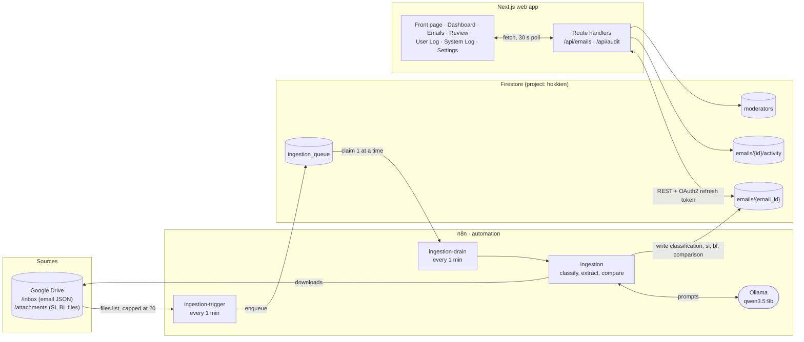

<div align="center">


# Shiptuationship

### AI Logistics Assistant

**From a noisy shipping inbox to a clear discrepancy report.**
Shiptuationship reads every incoming email, works out what it is, compares the Shipping Instruction (SI) against the draft Bill of Lading (BL) on seven fields, and hands anything uncertain to a human reviewer, with the evidence attached.

*Built for the **Averis Hackathon 2026**.*

</div>

---

## Table of contents

1. [The problem](#1-the-problem)
2. [Our solution at a glance](#2-our-solution-at-a-glance)
3. [Technical architecture](#3-technical-architecture)
4. [Setup instructions](#4-setup-instructions)
5. [Implementation details](#5-implementation-details)
6. [Challenges faced](#6-challenges-faced)
7. [Known limitations](#7-known-limitations)
8. [Future roadmap](#8-future-roadmap)
9. [Project structure and scripts](#9-project-structure-and-scripts)

---

## 1. The problem

> **The challenge:** turn a busy shipping-operations inbox into a clear, trustworthy discrepancy report, from the raw email all the way to "these fields don't match, and here is why."

### 1.1 Context

A shipping operations team receives very different messages in **one shared inbox**: requests to check documents, requests to prepare new shipping instructions, invoice questions and operational updates, with spam arriving alongside them.

For a **document-checking request**, the team compares a **Shipping Instruction (SI)**, which holds the intended shipment details, against a **draft Bill of Lading (BL)**. The SI is the reference. The goal is to **catch incorrect details before the draft is finalised**.

### 1.2 The three problems

| # | Problem | Why it hurts |
|---|---------|--------------|
| 1 | **Finding the right emails takes time.** Staff must read each message and decide what it needs. | A document request that is overlooked never reaches the checking step. |
| 2 | **Manual comparison is repetitive and error-prone.** Names, ports, quantities and weights must be checked across two documents. | A missed discrepancy means corrections, delays and extra work. |
| 3 | **The same information looks different.** One document says "Port of Loading", the other says "Load Port". | The system has to recognise that both labels mean the same field. |

### 1.3 What the system must be able to do

| Capability | What it means |
|------------|---------------|
| **Classify** | Tell messages apart: document-comparison requests, new SI requests, invoice queries, general messages and spam. Only document-comparison requests continue to the checking step. |
| **Extract data** | For comparison requests, read the SI and BL attachments and identify the matching shipment fields. |
| **Compare** | Check the values and surface every mismatched field, showing the **SI and BL values side by side**. |
| **Ask for help** | When the system cannot finish on its own, **escalate to a person (human in the loop)** with the relevant context, instead of guessing or failing silently. |

### 1.4 What is compared: the seven fields

| # | Field | Notes |
|---|-------|-------|
| 1 | Shipper | |
| 2 | Consignee | |
| 3 | Notify Party | |
| 4 | Port of Loading (POL) | |
| 5 | Port of Discharge (POD) | |
| 6 | Container count | integer |
| 7 | Gross weight | in **kilograms** |

The report must make it easy to see **which email was checked, whether a mismatch was found, and exactly what needs attention**. If all seven fields match, report **"No mismatch detected."**

> **Worked example:** the SI lists 3 containers and 22,000 kg, the BL lists 4 containers and 22,000 kg. If everything else agrees, flag **only** the container count and show **SI: 3 / BL: 4**.

### 1.5 Where it gets hard: real-world inboxes

Classifying emails, pulling fields out of a plain-text file and comparing seven values is the easy part. Real inboxes are much messier, and that is where a system like this earns its keep:

- **Documents that aren't plain text.** SIs and BLs arrive as PDFs, Word files and spreadsheets, with tables and layouts that differ from sender to sender.
- **Scanned pages.** Some documents are just images of paper, so the text has to be read with OCR or a vision-capable model first.
- **Untidy details.** Fields are labelled differently from one document to the next, formats vary, an email's subject line may have nothing to do with what it asks for, and an attachment may simply be missing. The system has to tell a *genuine* discrepancy apart from a reading or formatting quirk.
- **Knowing when not to decide.** If a document is unreadable, a value is missing or the result is uncertain, the honest move is to hand the case to a person **with the source evidence and the reason**, let them confirm or correct it, and update the report. Processing failures need to be **visible** and **easy to retry**, never silent.

Success is measured by finding the **right requests** and the **right discrepancies** without raising **false alarms**. The input is a set of JSON inbox records plus the SI and BL attachments they reference.

### 1.6 How Shiptuationship answers it

| Requirement | Our answer | Where |
|-------------|------------|-------|
| Classify into 5 kinds of message | LLM classifier with a strict prompt and a validator. The categories are `Document-Comparison Request`, `New SI Request`, `Invoice Queries`, `General Messages` and `Other` (ambiguous or spam). | n8n `ingestion` → *Main Classifier* |
| Extract the 7 fields | LLM extractor with a full alias table (`POL`, `LOAD PORT`, `NTFY`, `G.W.` and so on), unit conversion (lbs, MT → kg) and container summing. | n8n `ingestion` → *Field Normalise* |
| PDF, Word, Excel, text attachments | Dedicated parsers per file type, including DOCX unzip and Excel row merging. | n8n `ingestion` |
| Compare and show SI vs BL side by side | **Deterministic** (non-LLM) comparison, then a side-by-side review screen. | n8n *Compare Fields* + web app *ReviewModal* |
| Real discrepancy vs formatting difference | Normalisation and a formatting/real/severity classification. Formatting-only differences are recorded but not flagged. | n8n *Compare Fields* |
| Human in the loop | Flagged and incomplete cases are queued for a moderator who can edit either document's values, save, and re-run the comparison. | Web app *Emails* page |
| Visible failures and retries | Per-email queue with `queued → processing → done / failed`, `last_error` recorded, one-line manual retry. | n8n `ingestion-drain` |
| "Which email, mismatch or not, what needs attention" | Dashboard, filterable email table, per-email discrepancy banner, audit logs. | Web app |

> **Not attempted in this version:** scanned or image-only PDFs (OCR / vision). See [Known limitations](#7-known-limitations) and the [roadmap](#8-future-roadmap).

---

## 2. Our solution at a glance

Shiptuationship has **two halves** that share one database:

- **An automated back end (n8n + a local LLM)** that watches a Google Drive inbox, classifies every email, extracts the seven fields from the SI and BL attachments, runs the comparison and writes the result to **Firestore**.
- **A web app (Next.js)**, the *AI Logistics Assistant*, with a public front page and a logged-in desk where an operator sees everything at a glance, reviews flagged emails side by side, corrects values, marks emails as read, and audits what both the automation and the humans did.

### Feature tour

| Area | What you get |
|------|--------------|
| **Front page and login** | A product-style front page at `/` (always light, sections fade in as you scroll where the browser supports it). **Log in** signs in as the preset moderator and opens `/dashboard`. Clicking your profile (top right, or the avatar on phones) opens a menu with **Log out**, which returns to the front page. A demo sign-in, not real authentication (see [Known limitations](#7-known-limitations)). |
| **Dashboard** | Live counters (unread and read with a progress bar and per-category breakdown), **Total Comparison Requests** with one-click **Emails Cleared** and **Pending Validation** buttons, an interactive **Emails by Category** donut (click a slice to highlight it, click again to open those emails), **Top 3** shippers, consignees, notify parties and senders, and two **world heat maps** (outbound Port of Loading, inbound Port of Discharge). |
| **Emails** | A Gmail-style inbox: unread rows are bold with a dot, filter tabs (All / Comparisons / SI Requests / Invoices / General / Other, plus **Needs Review** and **Validated**), search, date-range picker, sortable columns. Every filter has its own URL (`/emails?view=needs-review`). Cards on phones and tablets. |
| **Review screen** | For comparison emails: manifest fields form, **SI and Draft BL side by side** with the differing fields in red (only on the document being edited), an *Editing: Carrier Draft BL / Customer SI* switch, save with an automatic re-comparison and "Mark as read". A **Read Email** view swaps the comparison for the original email (the form hides so the email gets the whole window). Round **‹ ›** buttons beside the window (and the left/right arrow keys) step to the previous or next email in the list as currently filtered and sorted. **Print** opens an A4 print preview in a new tab (save it as a PDF). Attachments that n8n stored a Drive link for (the SI and BL files) open in Google Drive. **Generate auto reply** shows a loading cogwheel and then an editable, copyable reply box; the text itself is not generated yet (see limitations). On phones the *Human review required* reasons fold away behind a chevron. |
| **User Log** | A chronological audit feed of every **moderator action** (reviews saved, emails marked read), with before/after field changes you can expand. |
| **System Log** | The same feed for everything the automation did (classified, auto-compared), shown as **Ship AI** with the Shiptuationship logo as its avatar. |
| **Settings** | Five colour schemes for the app: Light, Dark (true black), Ocean, Forest and Sunset. The front page ignores them and is always light. |
| **Everywhere** | Fully responsive (drawer menu on phones, cards instead of tables), animated but respects *reduced motion*, refreshes from Firestore every 30 s. |

---

## 3. Technical architecture

### 3.1 Big picture



### 3.2 End-to-end flow of one email

1. **A file lands in the Drive `/inbox` folder** (an email in JSON form).
2. **`ingestion-trigger`** (every minute) asks Drive for the 20 oldest files at or after its cursor and writes one small **queue row** per file to Firestore (`status: queued`).
3. **`ingestion-drain`** (every minute) claims queued rows **one at a time** (`processing`) and runs the `ingestion` sub-workflow for each.
4. **`ingestion`** does the real work:
   1. Parses the email JSON and **classifies** it (LLM, strict JSON, validated).
   2. Logs the email to Firestore (`emails/{email_id}`) with its classification.
   3. For **Document-Comparison Requests**: finds each attachment in Drive, parses it by type (TXT / PDF / XLSX / DOCX), asks the LLM to **extract the 7 fields** and to say whether it is an **SI or a BL**, then stores the result under `si` and `bl`.
   4. Runs a **deterministic comparison** in code and writes `comparison`, `status` (`cleared` / `flagged` / `incomplete`) and `human_review_required`.
5. The queue row is marked `done` or `failed` (with `last_error`).
6. **The web app** reads `emails` through its own API routes. An operator opens a flagged email, sees the SI and BL side by side, corrects a value if the extraction was wrong, and saves.
7. The save is written as a **moderator override** (never touching what n8n wrote), the comparison is re-run, and an **activity record** is added, which feeds the **User Log**. The n8n side feeds the **System Log**.

### 3.3 Technology stack

| Layer | Technology | Responsibility |
|-------|------------|----------------|
| Front end | **Next.js 16** (App Router), **React 19**, **TypeScript** | Dashboard, inbox, review UI, audit logs |
| Styling | Hand-written **CSS** (design tokens and per-theme variables). No CSS framework | Responsive layout, five colour schemes |
| Charts | Custom **SVG** donut and bars, **Google Charts GeoChart** (loaded from `gstatic`, no API key) | Category chart, top-3 bars, heat maps |
| Server side of the web app | Next.js **route handlers** (Node runtime) | Talk to Firestore. Credentials never reach the browser |
| Access gate (demo) | A session cookie plus Next.js **`proxy.ts`** | Keeps logged-out visitors on the front page and off the data API. Not real authentication |
| Database | **Google Cloud Firestore** via its **REST API** | Single source of truth |
| Auth to Firestore | **Google OAuth2 refresh token** (same model as the n8n credential) | No service account, no Firebase SDK |
| Automation | **n8n** (3 exported workflows in [`n8n/`](n8n)) | Ingestion, orchestration, comparison |
| AI | **Ollama** running **`qwen3.5:9b`** | Classification and field extraction |
| File storage | **Google Drive** | Dataset: `/inbox` emails and `/attachments` SI/BL files |
| Comparison | **JavaScript (n8n Code node)**, deterministic | 7-field comparison with normalisation |

### 3.4 Data model (Firestore)

<details>
<summary><b><code>emails/{email_id}</code></b>: one document per email (click to expand)</summary>

| Field | Written by | Meaning |
|-------|-----------|---------|
| `email_id`, `subject`, `body`, `from`, `to`, `received_at` | n8n | Original email record. (`received_at` is empty in the sample data, so the UI uses `classified_at`.) |
| `attachments[]`, `attachment_count` | n8n | Attachment file names |
| `classification` | n8n | One of the 5 categories |
| `classified_at` | n8n | When the automation processed it. This is the date shown in the app |
| `classification_error`, `last_ingestion_error`, `missing_attachments_warning` | n8n | Why something needs human attention |
| `si`, `bl` | n8n | Extracted fields: `shipper`, `consignee`, `notify_party`, `port_of_loading`, `port_of_discharge`, `container_count`, `gross_weight_kg` |
| `si_source`, `bl_source` | n8n | The source attachment: `filename`, `drive_file_id` and `drive_link` (its Google Drive URL, which the web app uses to link that attachment) |
| `comparison` | n8n | `status`, `performed_at`, `discrepancies[]`, `formatting_notes[]`, and per-field `{ match, bl, si, discrepancy_type, severity, *_normalized }` |
| `status` | n8n, web app | `pending` / `needs_review` / `incomplete` / `flagged` / `cleared` |
| `human_review_required` | n8n, web app | `true` when a person must look at it |
| `review` | **web app** | `reviewed_by`, `reviewed_at`, `edited_side`, and the override maps `fields` (BL) and `si_fields` (SI) |
| `read_status` | **web app** | `is_read`, `marked_by`, `marked_at` |

</details>

<details>
<summary><b>Other collections</b> (click to expand)</summary>

| Path | Purpose |
|------|---------|
| `emails/{id}/activity/{eventId}` | Immutable audit record per moderator action: `moderator_id`, `action` (`review_saved` / `marked_read`), `edited_side`, `changes` (per-field before and after), `before`, `after`, `occurred_at` (server time). Feeds the **User Log** |
| `moderators/{id}` | Moderator profile (auto-created on first action) |
| `ingestion_queue/{createdTime}_{driveFileId}` | One row per Drive file: `file_id`, `name`, `created_time`, `status` (`queued → processing → done / failed`), `queued_at`, `claimed_at`, `finished_at`, `last_error` |

</details>

> **Design rule:** the web app **never edits** the `si` / `bl` maps that n8n writes. Human corrections live under `review.*`, so the original extraction is always preserved and a re-ingestion can never erase a human decision.

### 3.5 Web API (Next.js route handlers)

| Route | Method | Purpose |
|-------|--------|---------|
| `/api/emails` | `GET` | List emails, mapped to the shape the UI uses |
| `/api/emails/{id}/review` | `POST` | Body `{ side: "si" \| "bl", fields }`: save a verified override for one side, re-run the comparison, log the activity |
| `/api/emails/{id}/read` | `POST` | Mark an email as read (idempotent) |
| `/api/audit?source=user\|system` | `GET` | User Log (moderator activity) or System Log (n8n activity) |

Errors return `502` (Firestore unreachable), `404` (unknown email), `409` (conflict or precondition failed). Without the demo session cookie (see [5.4](#54-human-in-the-loop-the-web-app)) every `/api/*` route returns `401 {"error":"Log in to continue"}`.

---

## 4. Setup instructions

### 4.1 Prerequisites

| Need | Version / note |
|------|----------------|
| **Node.js** | 20.9 or newer (the team develops on Node 24) |
| **npm** | Comes with Node |
| **Google Cloud project with Firestore** | Project id defaults to `hokkien`. Override with `FIRESTORE_PROJECT_ID` |
| **A Google OAuth client** | The same client n8n's Firestore credential uses is fine |
| **n8n** | For the ingestion pipeline (only needed if you want to *produce* data, not just view it) |
| **Ollama with `qwen3.5:9b`** | `ollama pull qwen3.5:9b`. Reachable from n8n |
| **Google Drive folder** | Structure below |

Dataset layout in Google Drive:

```
/bundle
├─ /inbox         email records, one .json per email
└─ /attachments   SI and BL files (.txt .xlsx .pdf .docx)
```

### 4.2 Run the web app

```bash
# 1. Install
npm install

# 2. Create your local environment file (never committed)
cp .env.example .env.local        # Windows PowerShell: Copy-Item .env.example .env.local

# 3. Fill in .env.local (see 4.3), then start the dev server
npm run dev                        # http://localhost:3000
```

Open `http://localhost:3000` and click **Log in** to enter the app (the app pages and the API need the demo session, see 5.4).

Production build:

```bash
npm run build && npm run start
```

Type-check only: `npx tsc --noEmit`

### 4.3 Environment variables (`.env.local`)

| Variable | Required | Description |
|----------|:--------:|-------------|
| `GOOGLE_CLIENT_ID` | yes | OAuth client id |
| `GOOGLE_CLIENT_SECRET` | yes | OAuth client secret |
| `GOOGLE_REFRESH_TOKEN` | yes | Refresh token granted with scope `https://www.googleapis.com/auth/datastore` |
| `FIRESTORE_PROJECT_ID` | no | Defaults to `hokkien` |
| `NEXT_PUBLIC_SITE_URL` | no | Public address of the deployed site. Used for link previews (Open Graph). Defaults to `http://localhost:3000` |

> **Never commit `.env.local`.** It is already listed in `.gitignore`. Keep secrets out of screenshots, issues and commits.

### 4.4 Getting the Google refresh token (one time)

1. In the Google Cloud console go to **APIs & Services → Credentials** and use the OAuth client n8n already uses (or create a *Web* client).
2. Add `https://developers.google.com/oauthplayground` as an **authorised redirect URI** on that client.
3. Open the [OAuth 2.0 Playground](https://developers.google.com/oauthplayground/), tick **Use your own OAuth credentials**, paste your client id and secret, authorise the scope `https://www.googleapis.com/auth/datastore`, then **exchange the code for tokens** and copy the **refresh token**.
4. The Google account you consent with needs the **Cloud Datastore User** IAM role on the Firestore project.
5. Paste the three values into `.env.local`.

**Check it works:** click **Log in** on `http://localhost:3000`, then open `http://localhost:3000/api/emails` in the same browser. You should get a JSON array (empty until n8n has ingested something).

### 4.5 Set up the ingestion pipeline (n8n)

1. **Import** all three files from [`n8n/`](n8n): `ingestion.json`, `ingestion-trigger.json`, `ingestion-drain.json`.
2. **Create credentials** in n8n:

   | Credential | Used by |
   |------------|---------|
   | Google Drive OAuth2 | Trigger (list files), `ingestion` (download email and attachments) |
   | Google Firebase Cloud Firestore OAuth2 | All three workflows |
   | Ollama API | `ingestion` (both LLM nodes) |

3. In `ingestion-drain`, open the **Ingest Email** node and **re-select the `ingestion` workflow** (the export does not carry the workflow id).
4. Point the Drive nodes at **your** `/inbox` and `/attachments` folders.
5. **Activate** `ingestion-trigger` and `ingestion-drain`. (`ingestion` is a sub-workflow and stays inactive.)
6. Drop email JSON files into the Drive `/inbox` folder. Within a minute or two they appear in Firestore, then in the app.

**Self-hosted n8n (Docker) tuning**, recommended for large PDF/XLSX files:

```
N8N_DEFAULT_BINARY_DATA_MODE=filesystem      # keep file binaries out of the Node heap
NODE_OPTIONS=--max-old-space-size=4096       # bigger heap (give the container at least 5 GB)
```

### 4.6 Troubleshooting

| Symptom | Likely cause and fix |
|---------|----------------------|
| `/api/emails` returns `401` *Log in to continue* | You are not logged in. Click **Log in** on the front page first |
| `/api/emails` returns `502` with *Missing GOOGLE_CLIENT_ID…* | `.env.local` is missing or incomplete. Restart `npm run dev` after editing it |
| `OAuth token refresh failed` | Wrong client id/secret, or the refresh token was issued for another client |
| `Firestore 403` | The Google account lacks **Cloud Datastore User** on the project |
| Dashboard shows zeros | Firestore is empty. Run the n8n pipeline (or check the queue for `failed` rows) |
| Saving a review says *record changed while saving* (`409`) | Someone (or n8n) changed the email at the same moment. Refresh and save again |
| Maps do not draw | The browser could not reach `gstatic.com` (Google Charts). Check your connection |

<details>
<summary><b>Operational notes for the ingestion pipeline</b> (click to expand)</summary>

- Enqueue is **create-only** (`currentDocument.exists=false`). The Drive query is `createdTime >= cursor`, so the boundary file is listed once more each run, Firestore answers `400 FAILED_PRECONDITION`, and **Check Enqueue** skips it. Any other status fails the execution visibly.
- Only **one drain runs at a time** (the *Gate* node). Claiming a row is atomic (`currentDocument.updateTime` precondition) as a second line of defence.
- A drain that **crashes** leaves its row in `processing`. After 15 minutes the next drain re-queues it (`last_error: requeued: previous drain crashed`). Raise `STALE_MS` in *Gate* if one email can legitimately take longer.
- `failed` rows stay in place for inspection. **To retry, set `status` back to `queued`** in Firestore.
- An email with no attachments finishes `ingestion` with zero items. *Ingest Email* has **Always Output Data** on so *Mark Done* still runs, otherwise the loop would stall on that row.
- "Stop" on a running drain only marks it cancelled. Child `ingestion` executions already in memory keep going. If you see orphans, restart the n8n container.
- **Re-uploaded or revised emails:** the dedupe key is the **Drive file id, not `email_id`**. A revised `email_004.json` gets its own queue row, runs after the original (rows sort by `createdTime`) and overwrites the same `emails/email_004` document through an `updateMask`.
- Not covered: Drive's *Upload new version* keeps the same file id and fires `fileUpdated`, not `fileCreated`.

</details>

---

## 5. Implementation details

### 5.1 Ingestion workflows (n8n)

Three workflows are exported in [`n8n/`](n8n):

| Workflow | Role | Memory per execution |
|----------|------|----------------------|
| **`ingestion-trigger`** | Schedule (1 min). Cursor = newest `created_time` in `ingestion_queue`. Asks Drive for the **20 oldest** files at or after it and writes one small queue document per file. Never runs the heavy workflow itself | ≤ 20 × 3 fields |
| **`ingestion-drain`** | Schedule (1 min). Exits if another drain is still running, re-queues rows stuck in `processing`, reads ≤ 20 `queued` rows and loops them **one at a time**: claim → `ingestion` → mark `done` / `failed` | ≤ 20 sub-results, one email in flight |
| **`ingestion`** | The actual pipeline for one email (34 nodes) | one email |

**Why the queue?** The native Google Drive Trigger has no limit: a 250-file drop would land in a single execution and hold 250 sub-workflow results in one heap. A capped `files.list` plus a Firestore queue means every run is bounded (20 files), retryable and visible.

### 5.2 Classification

A local LLM (`qwen3.5:9b`, "no-think" mode) returns **exactly one** JSON classification. The prompt is hardened for messy real-world inputs:

- The email is treated as **untrusted data**. Instructions inside it are never followed (prompt-injection guard).
- **Classify by the body, not the subject.** Subjects can be forwarded, re-used or misleading. The subject is only a tiebreaker.
- A document-comparison request stays a comparison request **even if an attachment is missing**, so it still reaches a human instead of vanishing.
- If a message fits several categories the priority is **comparison > new SI > invoice > general**. Anything ambiguous, unrelated or spam is **`Other`**.

A code node then **validates** the answer against the five allowed values. If the model fails or returns something invalid the email is stored as `Other` with `classification_error` and `status: needs_review`, so nothing is lost silently.

### 5.3 Attachment handling and field extraction

For each attachment of a comparison request:

1. **Find** it in the Drive `/attachments` folder. Zero matches or more than one match is a recorded error (`Attachment not found` / `ambiguous`), not a guess.
2. **Parse by type:** `.txt` (text), `.pdf` (text extraction), `.xlsx` (rows are combined into text), `.docx` (unzipped and read). Unsupported types are logged as an attachment error.
3. **Extract** with the LLM into strict JSON. The prompt covers:
   - **Document type detection** (`BL`, `SI` or `UNKNOWN`) from the document's own content. The filename is only a hint, so a mislabelled file is not assumed to be a BL.
   - **Label aliases** for every field (for example `SHPR`, `EXPORTER`; `CNEE`, `TO ORDER OF`; `NTFY`; `POL`, `LOAD PORT`; `POD`, `DEST`; `CNTR`; `G.W.`, `WGT`), which addresses the "Port of Loading vs Load Port" problem.
   - **Names only:** stop before street addresses, phone numbers and tax ids. "To Order" is a label, not a name.
   - **Numbers made comparable:** container counts are summed (`2 x 20', 1 x 40'` → 3). Weights are converted to kg (lbs × 0.453592, MT × 1000) with thousands separators stripped.
   - **Never invent:** a field that is genuinely absent is `null`.
4. **Validate before storing.** A code node checks the LLM's JSON: the document type must be `BL` or `SI`, text fields must be strings or `null`, the container count must be a whole number, the weight a non-negative number. An extraction that contains none of the seven fields is **rejected** rather than allowed to overwrite stored data.
5. Store the result under `si` / `bl` with the source file recorded (`filename`, `drive_file_id`). This version keeps **one SI and one BL per email**.

### 5.3.1 Comparison (deterministic, no LLM)

Comparing is deliberately **plain code**, so the same input always gives the same answer:

| Rule | Behaviour |
|------|-----------|
| Both values missing | Counts as a match |
| One value missing | **Discrepancy**, severity `major` |
| Container count | Must be **exactly equal** |
| Gross weight | Equal within **0.5 %** |
| Text fields | If equal ignoring case: match. Otherwise both are **normalised** (upper-case, punctuation and dots removed, bracketed port codes like `(MYPKG)` removed, trailing country dropped for ports, `TO ORDER` prefixes unified, extra spaces collapsed) |
| After normalising | **Equal → formatting difference:** recorded in `formatting_notes`, **not flagged** (avoids false alarms). One string inside the other → `real` / `minor`. Otherwise → `real` / `major` |

Result: `comparison.status` is **`flagged`** if any real discrepancy exists, otherwise **`cleared`**, and `human_review_required` is set to match. If the SI or BL side could not be extracted at all, the status is **`incomplete`** and the case is routed to a human.

### 5.4 Human in the loop (the web app)

The web app is where "ask for help" happens.

- **Where the humans are pulled in:** the pipeline marks cases `flagged` (real discrepancy), `incomplete` (missing SI or BL) or `needs_review` (classification error), each with `human_review_required` where a person must act. `flagged` comparison emails appear in the **Emails** page under **Needs Review** (and on the dashboard's red **Pending Validation** button). Clean ones appear under **Validated**. The other two states are stored in Firestore but shown in the inbox as "Received" for now (see [limitations](#7-known-limitations)).
- **Review screen:** the left pane holds the seven editable fields for **one document at a time** (switch *Carrier Draft BL* / *Customer SI*). The right pane shows the **SI and Draft BL as paper documents side by side**. Fields that differ are shown in **red text on the document being edited**, and the *Human review required* section at the top lists the reasons (it can be folded on phones). *Read Email* replaces the comparison with the original email and hides the form.
- **Save flow (`POST /api/emails/{id}/review`):**
  1. Load the email and refuse if there is no SI/BL pair to compare.
  2. Compare the edited side against the other side with the same seven-field rule. The result sets `status` to `flagged` or `cleared` and `human_review_required` accordingly.
  3. Write **`review.fields`** (BL) or **`review.si_fields`** (SI) with a **nested `updateMask`**, so saving one side keeps the other side's override.
  4. Add an **`activity`** document (who, what, before and after, server timestamp) **in the same atomic commit**, guarded by the document's `updateTime` so concurrent edits are rejected instead of overwritten.
- **Around the review:** the ‹ › buttons and arrow keys move to the previous or next email in the current list, **Print** builds an A4 print preview of everything known about the email (details, review reasons, the field-by-field comparison, body, attachments, audit trail) in a new tab, and attachments open the `drive_link` that n8n stored (only the SI and BL files have one). Moving to another email discards unsaved edits, with a toast.
- **Read state:** "Mark as read" is stored separately from the comparison status (`read_status`), is idempotent, and drives the Gmail-style bold and dot in the inbox and the dashboard's read/unread progress.
- **Identity:** the app runs as a **preset moderator (`DanielHo`)**. The front page's **Log in** button is a one-click demo sign-in: it sets a session cookie (`lib/session.ts`) and `proxy.ts` sends logged-out requests for app pages back to `/` and answers `401` on `/api/*`. **Log out** (in the profile menu) clears it. This is not real authentication, and everyone is attributed to that identity. Existing records without attribution stay "unknown" and are never retro-assigned.

### 5.5 Audit logs

Two separate pages, both read-only and built only from Firestore:

| Page | Source | Shows |
|------|--------|-------|
| **User Log** (`/audit/user`) | `emails/*/activity` (a collection-group query) plus `moderators` for display names | Reviews saved (with expandable per-field before → after diffs) and marked-read events |
| **System Log** (`/audit/system`) | `classified_at` and `comparison.performed_at` on each email | What the n8n automation did: classified as *X*, ran the SI/BL comparison with its result |

The System Log's actor is stored as "n8n Workflow" in the data and displayed as **Ship AI** (with the logo as its avatar) by the web app.

Both have dropdown filters (**Action** and **User**) whose choice lives in the URL (`?action=review_saved&user=Daniel%20Ho`), day dividers (Today / Yesterday / date), and refresh every 30 s.

### 5.6 Front-end engineering

| Topic | What we did |
|-------|-------------|
| **State in the URL** | Every filter tab, log filter and status view is a real link, so views are shareable and the back button works |
| **Shared data provider** | One fetch and 30 s poll (`ShipmentsProvider`) feeds Dashboard and Emails, so switching pages is instant |
| **Server-only secrets** | `lib/firestore.ts` (OAuth and REST) is imported only by route handlers. The browser never sees a credential |
| **Time handling** | The app stores UTC ISO timestamps and formats them in the viewer's own time zone (`dd/mm/yy` and 24-hour time) |
| **Responsive design** | ≤ 900 px: drawer menu and top bar. ≤ 1279 px: table becomes cards. Tuned for phones, iPads and landscape, with safe-area insets and `dvh` units |
| **Theming** | CSS variables per scheme (`data-theme` on `<html>`). Inside the app the saved choice is applied *before first paint* by a tiny inline script, so there is no flash. Maps redraw with the scheme's colours. The logged-out front page never loads that script, so it is always light |
| **Front page** | Server-rendered at `/` for logged-out visitors (`components/Landing.tsx`); the layout only mounts the app shell and its data fetching once the session cookie exists. Sections fade in with **CSS scroll-driven animation** (no script), which is skipped, leaving everything visible, in browsers without support or with reduced motion |
| **Print** | `lib/printEmail.ts` builds a self-contained, escaped A4 page (`@page` size and margins, page-break rules) and opens it as a Blob in a new tab; nothing is stored or sent |
| **Performance** | Only the first ~15 table rows animate, the rest render instantly. IntersectionObserver gates heavy animations until visible. Count-up numbers and chart sweeps respect `prefers-reduced-motion` |
| **Accessibility** | Keyboard-operable slices, rows and menus, ARIA roles on the progress bar and radio groups, focus rings, and reduced-motion support |
| **Branding and sharing** | Custom vector logo (traced from the source PNG), favicon, and Open Graph and Twitter card metadata with a 1200×630 preview image (`public/opengraph.png`) |

### 5.7 Security and safety

- **Untrusted input:** emails and attachments are treated as data in every prompt, and the classifier and extractor are told never to obey instructions found inside them.
- **No silent guessing:** every uncertain path (bad classification, missing attachment, unreadable file, incomplete SI/BL) ends in a **visible status** and a human queue, never a fabricated value.
- **Secrets:** OAuth credentials live only in `.env.local` (git-ignored) and n8n credentials. Nothing sensitive is in the repository.
- **Demo access gate:** without the session cookie the app pages redirect to the front page and `/api/*` answers `401`. It is a convenience gate for a demo, not authentication: anyone can set the cookie.
- **Write safety:** moderator writes use Firestore preconditions and one atomic commit, so concurrent edits fail loudly instead of corrupting data.

---

## 6. Challenges faced

| Challenge | What happened | How we solved it |
|-----------|---------------|------------------|
| **The same field, written many ways** | `POL`, `Load Port`, `Port/Place of Loading`, `SHPR`, `To Order of`… | An explicit alias table in the extraction prompt, plus post-extraction **normalisation** so `PORT KLANG (MYPKG)` and `Port Klang` still match |
| **Real discrepancy or just formatting?** | Comparing raw strings raised false alarms on punctuation, casing, port codes and country suffixes | A deterministic comparison with normalisation, a 0.5 % weight tolerance, and a `formatting` vs `real` (`minor` / `major`) classification. Formatting-only differences are logged but not flagged |
| **Misleading subjects and prompt injection** | Subjects can be reused or forwarded. Bodies can contain instructions | Classify by **body**, treat all text as untrusted, validate the output against the five allowed categories |
| **Mixed attachment formats** | TXT, PDF, XLSX and DOCX each need different parsing | Type-based routing, DOCX unzip and text read, Excel row merging, and explicit errors for unsupported or missing or ambiguous files |
| **LLM variability** | Small local models can return malformed JSON | Strict "JSON only" prompts, a validator with a safe fallback (`Other` + `needs_review`), and **no LLM in the comparison** |
| **n8n running out of memory on large drops** | The Drive Trigger returns *every* new file, so a 250-file drop held 250 results in one heap and crashed the LLM step | Replaced it with a **capped queue** (20 files per run), a single-drain **gate**, stale-row recovery, filesystem binary mode and a bigger heap |
| **Never lose or double-process an email** | Retries, crashes and re-uploads | Create-only enqueue, atomic claims, stale re-queue after 15 min, and file-id (not `email_id`) as the dedupe key |
| **Human edits vs the automation's data** | A re-ingestion could overwrite a moderator's correction | Human corrections live in a separate `review.*` namespace with a nested field mask, so neither side clobbers the other |
| **Concurrent moderators** | Two people saving the same email | Firestore `updateTime` preconditions in one atomic commit. A conflict returns `409`, and the UI asks the user to refresh |
| **Dates were empty** | `received_at` is blank in the sample data, and server vs browser time zones disagreed | Use `classified_at`, carry ISO UTC to the browser and format there, so filters and labels always agree |
| **Firestore without an SDK** | We wanted one auth model shared with n8n and no service account | A small REST client with an OAuth refresh-token exchange and value encoders and decoders |
| **Touch scrolling on tablets and phones** | Lists were clipped or unscrollable on some iPads and landscape phones | Fixed flex sizing for card mode, then re-checked scrolling and real touch swipes across a range of phone, tablet and landscape sizes |
| **Polish across five themes** | Hard-coded colours everywhere | Introduced design tokens, moved every neutral onto variables, added per-scheme blocks and made the maps and the paper documents theme-aware |

---

## 7. Known limitations

Being honest about what this version does **not** do yet:

- **No OCR or vision.** Image-only or scanned PDFs are not read. PDF handling is text extraction, so those cases surface as errors or incomplete comparisons for a human.
- **Two comparison rules.** The pipeline compares **normalised** values (formatting differences are tolerated). The web app's live highlight and re-comparison on save uses **exact** text equality on the seven fields, so it can flag a formatting-only difference that n8n deliberately ignored.
- **`incomplete` and `needs_review` are not yet surfaced.** They are stored (with `human_review_required`) but the inbox shows them as "Received"; only `flagged` and `cleared` get their own view.
- **No real login.** The front page's **Log in** and the profile menu's **Log out** only set and clear a demo session cookie. All moderator actions are attributed to one preset identity (`DanielHo`).
- **Attachment links only for the SI and BL files.** n8n stores a `drive_link` only for the two files it extracts from, so other attachments show as plain names.
- **Auto reply is UI only.** *Generate auto reply* shows the loading state and an empty, editable, copyable box; no LLM is connected, so no text is generated, and the printout does not include a reply.
- **Polling, not push.** The UI refreshes every 30 s rather than streaming Firestore changes.
- **Limits of scale.** The email list reads one page (up to 300 documents) and the User Log one page (up to 500 activity records). The Drive trigger enqueues 20 files per minute and the drain is deliberately serial.
- **Retry is manual.** A `failed` queue row must be set back to `queued` in Firestore.
- **Local LLM quality.** Accuracy depends on `qwen3.5:9b`. There is no second-opinion model or confidence score yet.
- **No automated test suite** is included in this repository yet.

---

## 8. Future roadmap

### Near term (accuracy and reliability)
- [ ] **OCR and vision-LLM fallback** for scanned and image-only PDFs.
- [ ] **One shared comparison module** used by both n8n and the web app, so the highlight and the pipeline can never disagree.
- [ ] **Confidence scores and evidence:** store the source text snippet per extracted field and route *low-confidence* fields to review, not only mismatches.
- [ ] **One-click retry** for failed queue rows from the UI, with the failure reason shown.
- [ ] **Automated tests** for the comparison rules, the Firestore mapping and the API routes, plus an accuracy check that runs a labelled set of sample emails through the whole pipeline.

### Medium term (product)
- [ ] **Real authentication and roles** (moderator, viewer, admin) replacing the demo sign-in, so the audit logs show real people.
- [ ] **Realtime updates** with Firestore listeners or server-sent events instead of polling.
- [ ] **Notifications** (email or chat) when a comparison is flagged or a job fails.
- [ ] **Assignments and SLAs:** assign a review to a person, track time-to-resolution.
- [ ] **Generate the auto reply** with an LLM from the email and its comparison result.
- [ ] **A Drive link for every attachment** (not just the SI and BL) so each one can be opened from the email.
- [ ] **In-app PDF viewer** of the original attachments beside the extracted fields, and export a **discrepancy report** (PDF or CSV).
- [ ] **Pagination and search server-side** for large inboxes and long audit histories.

### Long term (platform)
- [ ] **Beyond SI vs BL:** invoices, packing lists, certificates of origin and other trade documents against the same field-mapping engine.
- [ ] **Learning from corrections:** feed moderator overrides back as few-shot examples or fine-tuning data, and learn per-customer label conventions.
- [ ] **Direct email integration** (IMAP or Gmail API) so the Drive drop-folder is no longer needed.
- [ ] **Analytics:** recurring discrepancy types per shipper, carrier or route, to fix problems at the source.
- [ ] **Multi-tenant deployment** with per-organisation data isolation and configurable comparison tolerances.

---

## 9. Project structure and scripts

```
.
├─ app/                        Next.js App Router
│  ├─ page.tsx                 Front page (product site) for logged-out visitors
│  ├─ dashboard/               Dashboard
│  ├─ emails/                  Inbox page
│  ├─ audit/user · audit/system    User Log and System Log
│  ├─ settings/                Colour schemes
│  ├─ api/
│  │  ├─ emails/               GET list
│  │  │  └─ [id]/review · read    POST moderator actions
│  │  └─ audit/                GET audit feed
│  ├─ layout.tsx               Metadata, Open Graph, theme bootstrap, session-aware shell
│  └─ globals.css              All styling and the colour schemes
├─ components/                 Landing (front page), LogInButton, Profile (menu), Dashboard, Emails, ReviewModal, AuditLog, charts, maps, shell…
├─ lib/
│  ├─ firestore.ts             Server-only Firestore REST client (OAuth, mapping, moderator actions)
│  ├─ shipments.ts             Types, the 7 fields, the deterministic UI comparison, date helpers
│  ├─ session.ts · printEmail.ts   Demo session cookie, and the A4 print preview
│  ├─ audit.ts · theme.ts      Log types (and the "Ship AI" bot name) and colour scheme registry
│  └─ ports.ts · top.ts · …    Port → country mapping, top-N, hooks
├─ proxy.ts                    Session gate: app pages and /api/* need the demo session
├─ n8n/                        ingestion.json · ingestion-trigger.json · ingestion-drain.json
├─ public/shiplogo.svg         Logo (vectorised)
├─ public/opengraph.png        Link preview image (1200×630)
├─ .env.example                Environment template
└─ README.md
```

| Script | What it does |
|--------|--------------|
| `npm run dev` | Development server on `http://localhost:3000` |
| `npm run build` | Production build |
| `npm run start` | Serve the production build |
| `npx tsc --noEmit` | Type-check the whole project |

---

<div align="center">

**Shiptuationship: catch the mismatch before the ship sails.**

</div>
